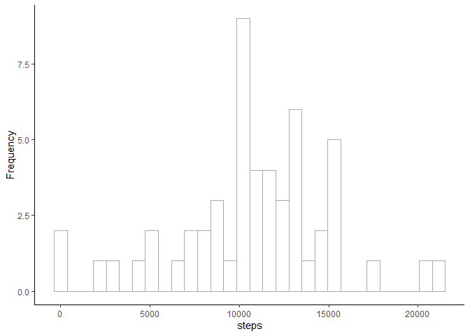
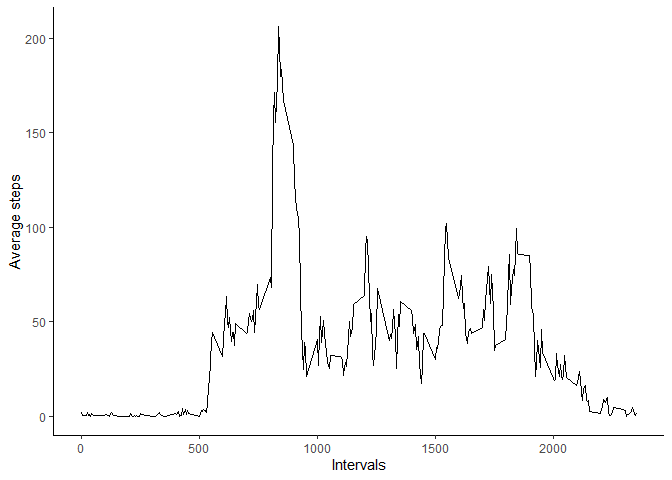
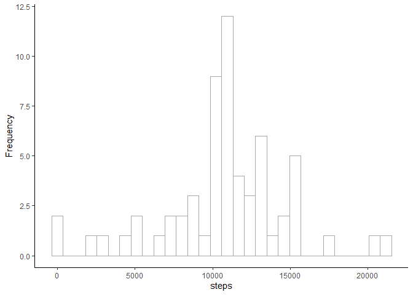
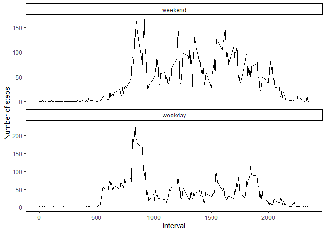

## Loading and preprocessing the data


```r
echo = T

Sys.setlocale("LC_ALL","English")
```

```
## [1] "LC_COLLATE=English_United States.1252;LC_CTYPE=English_United States.1252;LC_MONETARY=English_United States.1252;LC_NUMERIC=C;LC_TIME=English_United States.1252"
```

```r
library(tidyverse)
```

```
## -- Attaching packages --------------------------------------- tidyverse 1.3.2 --
## v ggplot2 3.4.0      v purrr   1.0.1 
## v tibble  3.1.8      v dplyr   1.0.10
## v tidyr   1.2.1      v stringr 1.5.0 
## v readr   2.1.3      v forcats 1.0.0 
## -- Conflicts ------------------------------------------ tidyverse_conflicts() --
## x dplyr::filter() masks stats::filter()
## x dplyr::lag()    masks stats::lag()
```

```r
library(lubridate)
```

```
## 
## Attaching package: 'lubridate'
## 
## The following objects are masked from 'package:base':
## 
##     date, intersect, setdiff, union
```

```r
if(!file.exists("./data")){dir.create("./data")}

unzip(zipfile = "./activity.zip",
      overwrite = T,
      exdir = "./data")

activity <- 
  read_csv("./data/activity.csv")
```

```
## Rows: 17568 Columns: 3
## -- Column specification --------------------------------------------------------
## Delimiter: ","
## dbl  (2): steps, interval
## date (1): date
## 
## i Use `spec()` to retrieve the full column specification for this data.
## i Specify the column types or set `show_col_types = FALSE` to quiet this message.
```

```r
glimpse(activity)
```

```
## Rows: 17,568
## Columns: 3
## $ steps    <dbl> NA, NA, NA, NA, NA, NA, NA, NA, NA, NA, NA, NA, NA, NA, NA, N~
## $ date     <date> 2012-10-01, 2012-10-01, 2012-10-01, 2012-10-01, 2012-10-01, ~
## $ interval <dbl> 0, 5, 10, 15, 20, 25, 30, 35, 40, 45, 50, 55, 100, 105, 110, ~
```

```r
activity <- 
  activity %>% 
  mutate(day = wday(date,
                    label = T),
         day_dic = fct_recode(day,
                          weekday = "Mon",
                          weekday = "Tue",
                          weekday = "Wed",
                          weekday = "Thu",
                          weekday = "Fri",
                          weekend = "Sat",
                          weekend = "Sun"))

glimpse(activity)
```

```
## Rows: 17,568
## Columns: 5
## $ steps    <dbl> NA, NA, NA, NA, NA, NA, NA, NA, NA, NA, NA, NA, NA, NA, NA, N~
## $ date     <date> 2012-10-01, 2012-10-01, 2012-10-01, 2012-10-01, 2012-10-01, ~
## $ interval <dbl> 0, 5, 10, 15, 20, 25, 30, 35, 40, 45, 50, 55, 100, 105, 110, ~
## $ day      <ord> Mon, Mon, Mon, Mon, Mon, Mon, Mon, Mon, Mon, Mon, Mon, Mon, M~
## $ day_dic  <ord> weekday, weekday, weekday, weekday, weekday, weekday, weekday~
```


## What is mean total number of steps taken per day?

### Calculate the total number of steps taken per day


```r
echo = T

activity %>%
  group_by(date) %>%  
  summarise(total = sum(steps))
```

```
## # A tibble: 61 x 2
##    date       total
##    <date>     <dbl>
##  1 2012-10-01    NA
##  2 2012-10-02   126
##  3 2012-10-03 11352
##  4 2012-10-04 12116
##  5 2012-10-05 13294
##  6 2012-10-06 15420
##  7 2012-10-07 11015
##  8 2012-10-08    NA
##  9 2012-10-09 12811
## 10 2012-10-10  9900
## # ... with 51 more rows
```

### Make a histogram of the total number of steps taken each day


```r
echo = T

activity %>%
  group_by(date) %>%  
  summarise(total = sum(steps)) %>%  
  ggplot(aes(total))+
  geom_histogram(color="darkgray",
                 fill="white")+
  scale_x_continuous("steps")+
  ylab("Frequency")+
  theme_classic()
```

```
## `stat_bin()` using `bins = 30`. Pick better value with `binwidth`.
```

<!-- -->

### Calculate and report the mean and median of the total number of steps taken per day


```r
echo = T

activity %>%
  group_by(date) %>%  
  summarise(total = sum(steps)) %>%
  drop_na(total) %>% 
  summarise(m = mean(total),
            md = median(total))
```

```
## # A tibble: 1 x 2
##        m    md
##    <dbl> <dbl>
## 1 10766. 10765
```

The mean and median of steps per day were 10766.19 and 10765.

## What is the average daily activity pattern?

### Make a time series plot (i.e.type = "l") of the 5-minute interval (x-axis) and the average number of steps taken, averaged across all days (y-axis)


```r
echo = T

activity %>% 
  drop_na(steps) %>% 
  group_by(interval)%>%
  summarise(average_steps = mean(steps)) %>%
  ggplot(aes(interval,
             average_steps))+
  geom_line()+
  theme_classic()+
  ylab("Average steps")+
  xlab("Intervals")
```

<!-- -->

### Which 5-minute interval, on average across all the days in the dataset, contains the maximum number of steps?


```r
echo = T

activity %>% 
  drop_na(steps) %>% 
  group_by(interval)%>%
  summarise(average_steps = mean(steps))   %>%
  group_by(interval) %>% 
  summarise(max_number_of_steps = max(average_steps)) %>% 
  arrange(desc(max_number_of_steps)) %>% 
  slice(1)
```

```
## # A tibble: 1 x 2
##   interval max_number_of_steps
##      <dbl>               <dbl>
## 1      835                206.
```

## Imputing missing values

### Calculate and report the total number of missing values in the dataset (i.e. the total number of rows with NAs)


```r
echo = T

activity %>%
  filter(if_any(.cols = everything(),
                ~ is.na(.x))) %>%
  summarise(across(.cols = everything(), 
                   ~ sum(is.na(.x))))
```

```
## # A tibble: 1 x 5
##   steps  date interval   day day_dic
##   <int> <int>    <int> <int>   <int>
## 1  2304     0        0     0       0
```

### Devise a strategy for filling in all of the missing values in the dataset. The strategy does not need to be sophisticated. For example, you could use the mean/median for that day, or the mean for that 5-minute interval, etc. Create a new dataset that is equal to the original dataset but with the missing data filled in.

Missing values were imputed with the mean value at the same interval across days. To evaluate the results, we sum the missing values of the variable steps in the new data frame


```r
echo = T

new_activity <- 
  activity %>%
  group_by(interval) %>% 
  mutate(steps = if_else(is.na(steps),
                            mean(steps, na.rm = T),
                            steps))

new_activity %>% 
  filter(is.na(steps)) %>% 
  summarise(total = sum(is.na(steps)))
```

```
## # A tibble: 0 x 2
## # ... with 2 variables: interval <dbl>, total <int>
```

### Make a histogram of the total number of steps taken each day.


```r
new_activity %>% 
  group_by(date) %>% 
  summarise(total = sum(steps)) %>% 
  ggplot(aes(total))+
  geom_histogram(color="darkgray",
                 fill="white")+
  scale_x_continuous("steps")+
  ylab("Frequency")+
  theme_classic()
```

```
## `stat_bin()` using `bins = 30`. Pick better value with `binwidth`.
```

<!-- -->

### Calculate and report the mean and median total number of steps taken per day. Do these values differ from the estimates from the first part of the assignment? What is the impact of imputing missing data on the estimates of the total daily number of steps?


```r
new_activity %>% 
  group_by(date) %>% 
  summarise(total = sum(steps)) %>% 
  summarise(m = mean(total),
            md = median(total))
```

```
## # A tibble: 1 x 2
##        m     md
##    <dbl>  <dbl>
## 1 10766. 10766.
```
The mean and median became equal, which shows a normal distribution of the data.

## Are there differences in activity patterns between weekdays and weekends?

### Create a new factor variable in the dataset with two levels – “weekday” and “weekend” indicating whether a given date is a weekday or weekend day. 

### Make a panel plot containing a time series plot (i.e.type = "l") of the 5-minute interval (x-axis) and the average number of steps taken, averaged across all weekday days or weekend days (y-axis). See the README file in the GitHub repository to see an example of what this plot should look like using simulated data.


```r
new_activity %>%
 group_by(interval,
           day_dic)%>%
  summarise(average_steps = mean(steps)) %>%
  ungroup() %>% 
  ggplot(aes(interval,
             average_steps))+
  geom_line()+
  theme_classic()+
  facet_wrap(~ day_dic,
             scales = "free_y", 
             ncol = 1)+
  xlab("Interval")+
  ylab("Number of steps")
```

```
## `summarise()` has grouped output by 'interval'. You can override using the
## `.groups` argument.
```

<!-- -->


